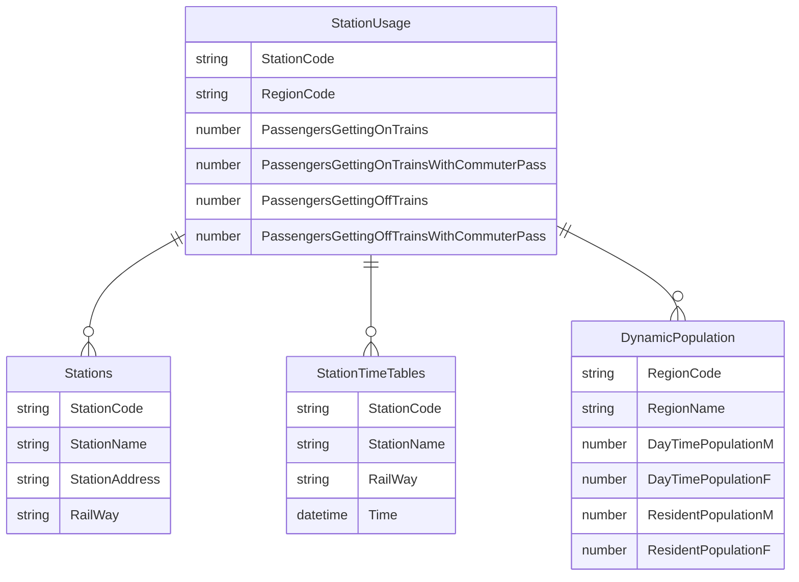

# Exploring Tokyo subway transportation data

Tokyo is a vibrant city where many people travel day and night every day. 13 different kinds of subway trains depart every few minutes at a peak time, and take passengers from town to town. Do they actually affect the population of each area? And how much would it be?

## Scope of the project
<!-- Explain what you plan to do in the project in more detail. What data do you use? What is your end solution look like? What tools did you use? etc -->

In this project, I will build an ETL pipeline to explore how people use subway trains and how it affects day/night population data of the city.
To achieve this goal, I would like to have the following data:

- Population by area
- List of stations
- Timetables
- Number of passengers at each station

Population and stations need to be associated with area, and timetables and passenger data need to be associated with stations.
Since timetables have a large amount of data, I have decided to use Spark to process them, and output parquet files to explore data, as they can be easily imported to other database or data warehouse later.

#### Data description
<!-- Describe the data sets you're using. Where did it come from? What type of information is included? -->

## Datasets used

Here is the list of datasets that I use in this project. Since two different organizations (Tokyo metro and Toei) run Tokyo subway trains, data files are separated by organizaton. In addition, supplemental data to correlate zip codes and addresses is also included.

| File name | Format | # of lines | Provided by |
|--|--|--|--|
| ZipTokyo.csv | CSV | 4,047 | Japan Post Holdings |
| Stations_addresses.csv | CSV | 10,886 | Ekidata |
| Stations_toei.json | JSON | 4,121 | Public Transportation Open Data |
| Stations_metro.json | JSON | 6,166 | Public Transportation Open Data |
| StationTimetable_toei.json | JSON | 1,024,605 | Public Transportation Open Data |
| StationTimetable_metro.json | JSON | 1,431,441 | Public Transportation Open Data |
| PassengerSurvey_toei.json | JSON |  | Public Transportation Open Data |
| PassengerSurvey_metro.json | JSON |  | Public Transportation Open Data |
| DynamicPopulation.csv | CSV | 80 | Tokyo Open Data |

## Data Dictionary

- `Stations`: Master table of subway stations
- `Timetables`: Timetable data for each subway station
- `Populations`: Population data for each 
- `StationUsage`: Daily usage statistics for each station

`Stations`, `Timetables`, `Poplulations` tables represents themselves as dimension tables.

StationUsage table is a fact table that shows daily usage of the station.
This table has `area_code` and `station_id` to join with `Stations` and `Populations` tables accordingly.

### Stations

| Column | Description |
|---|---|
| station_id | |
| zip_code | |
| area_code | |
| station_code | |
| survey_id | |
| station_name | |

### Timetables

| Column | Description |
|---|---|
| timetable_id | |
| station_id | |
| railway_id | |
| calendar_type | |
| train_type | |
| train_number | |
| departure_time | |

### Population

| Column | Description |
|---|---|
| area_code | |
| area_name | |
| area_name_ja | |
| daytime_population | |
| population | |

### PassengerSurvey

| Column | Description |
|---|---|
| usage_id | |
| station_id | |
| railway_id | |
| area_code | |
| survey_id | |
| year | |
| passengers | |

It’s possible that we will need to address the following issues in the future. Each of them can be addressed differently:

- **If the data was increased by 100x.**
    - I would use Spark for the data processing while the speed would be the biggest concern when it comes to large data size. To address the size issue, I would use data partitioning and parallels.
- **If the pipelines were run on a daily basis by 7am.**
    - I would use Airflow to schedule the pipelines. 
- **If the database needed to be accessed by 100+ people.**
    - Providing direct database access to 100+ people is not preferable in terms of convenience and governance. In general, these 100+ people have different reasons and motivations to access database. Instead of providing the access to the data warehouse, I would integrate the data warehouse with BI tools that allow users to create analytics dashboards meet their business needs.
