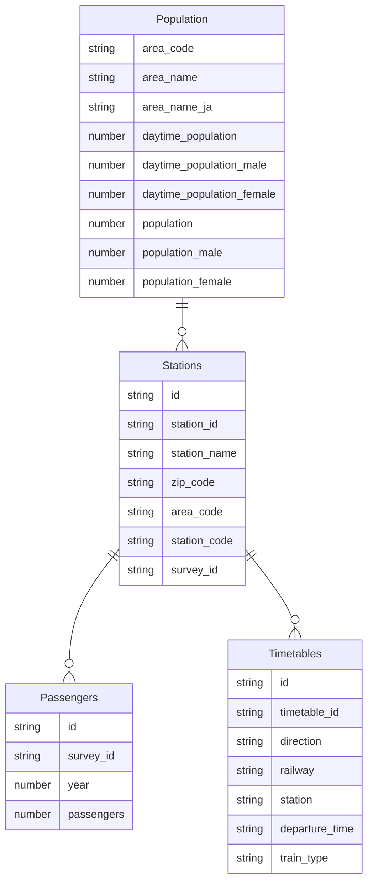

# Exploring Tokyo subway transportation data

Tokyo is a vibrant city where many people travel day and night every day. 13 different kinds of subway trains depart every few minutes during peak hours, and take passengers from town to town. Do they actually affect the population of each area? And how much would it be?

## Scope of the project
<!-- Explain what you plan to do in the project in more detail. What data do you use? What is your end solution look like? What tools did you use? etc -->

In this project, I will build an ETL pipeline to explore how people use subway trains and how it affects day/night population data of the city.
To achieve this goal, I decided to have the following data:

- Population by area
- List of stations
- Timetables
- Number of passengers at each station

Population and stations need to be associated with area in Tokyo, and timetables and passenger data need to be associated with stations.
Since timetables have a large amount of data, I chose Spark to process them, and output parquet files to explore data, as they can be easily imported to other database or data warehouse later.

## How this project is structured

- etl/
  - etl.py : The main ETL script. It builds data models from the datasets and save them into parquet files
  - helpers.py : File paths and data checks
  - sample_queries.py : Sample queries against created parquet files
  - config.ini : Definition and files and directories used
- data/ : Directory for datasets to be processed
- parquet/ : Directory for parquet files

To run the ETL script, run the following command:

```
python etl.py
```

Once the ETL script has successfully run and parquet files have been generated, run the following command to execute sample queries:

```
python sample_queries.py
```

## Data description
<!-- Describe the data sets you're using. Where did it come from? What type of information is included? -->

### Datasets used

Here is the list of datasets that I use in this project. Since two different organizations (Tokyo metro and Toei) run Tokyo subway trains, data files are separated by organizaton. In addition, supplemental data to correlate zip codes and addresses is also included.

| File name | Format | # of lines | Provided by |
|--|--|--|--|
| ZipTokyo.csv | CSV | 4,047 | Japan Post Holdings |
| StationAddresses.csv | CSV | 10,886 | Ekidata |
| Station_toei.json | JSON | 4,121 | Public Transportation Open Data |
| Station_metro.json | JSON | 6,166 | Public Transportation Open Data |
| StationTimetable_toei.json | JSON | 1,024,605 | Public Transportation Open Data |
| StationTimetable_metro.json | JSON | 1,431,441 | Public Transportation Open Data |
| PassengerSurvey_toei.json | JSON | 4,405 | Public Transportation Open Data |
| PassengerSurvey_metro.json | JSON | 6,103 | Public Transportation Open Data |
| DynamicPopulation.csv | CSV | 80 | Tokyo Open Data |
    
### Data Models

I have created four tables out of the datasets:

- `Stations`: Master table of subway stations
- `Timetables`: Timetable data for each subway station
- `Population`: Population data for each 
- `Passengers`: Daily usage statistics for each station

`Stations`, `Timetables`, `Poplulations` tables represents themselves as dimension tables.
`Passengers` table is a fact table that shows daily usage of the station.

Since `Stations` exists between `Passengers` and `Population` or `Timetables`, single join is not enough to associate the fact and dimension tables, thus this will be a Snowflake schema, which is not as simple as Star schema. However, I chose the schema because we thought it was natural to place stations at the center of the data.

### Data Dictionary

#### Stations

| Column | Description |
|---|---|
| station_id | Unique ID for the station |
| station_name | Name of the station |
| zip_code | Zip code |
| station_code | Station code |
| area_code | Area code (to join with Population table) |
| survey_id | Survey ID (to join with Passengers table) |

#### Timetables

| Column | Description |
|---|---|
| timetable_id | Unique ID for the timetable |
| station_id | Station ID |
| direction | Direction |
| railway | Railway |
| calendar_type | Calendar type (i.e. Weekday/Holiday) |
| train_type | Train type (i.e. Local/Express) |
| departure_time | Departure time of the train |

#### Population

| Column | Description |
|---|---|
| area_code | Unique code for the area in Tokyo |
| area_name | Area name in English |
| area_name_ja | Area name in Japanese |
| daytime_population | Population during daytime |
| daytime_population_male | Population during daytime (male) |
| daytime_population_female | Population during daytime (female) |
| population | Population |
| population_male | Population (male) |
| population_female | Population (female) |

#### Passengers

| Column | Description |
|---|---|
| id | Unique ID for the survet result |
| survey_id | Survey ID |
| year | Year the survey was conducted |
| passengers | Number of passengers |




### Example queries

Here are example queries that can be run against the created tables:

#### Query 1: Top 10 areas that have most subway stations

```sql
SELECT
    stations.area_code,
    stations.area_name,
    count(*) n_stations
FROM population
LEFT JOIN stations ON stations.area_code = population.area_code
GROUP BY population.area_code, population.area_name
ORDER BY n_stations DESC
LIMIT 10
```

#### Result of Query 1

```
+---------+-----------+----------+
|area_code|  area_name|n_stations|
+---------+-----------+----------+
|    13101| Chiyoda-ku|       125|
|    13104|Shinjuku-ku|        94|
|    13103|  Minato-ku|        76|
|    13113| Shibuya-ku|        52|
|    13102|    Chuo-ku|        52|
|    13116| Toshima-ku|        42|
|    13106|   Taito-ku|        39|
|    13108|    Koto-ku|        28|
|    13105|  Bunkyo-ku|        27|
|    13120|  Nerima-ku|        26|
+---------+-----------+----------+
```

#### Query 2: Top 10 areas with the largest day/night population differences, with the number of passengers in 2021

```sql
WITH population_summary AS (
  SELECT
      area_code,
      area_name,
      daytime_population - population population_diff
  FROM population
  ORDER BY population_diff DESC
  LIMIT 10
)
SELECT
  population_summary.area_code,
  population_summary.area_name,
  population_diff,
  SUM(passengers)
FROM population_summary
LEFT JOIN stations ON population_summary.area_code = stations.area_code
LEFT JOIN passengers ON stations.survey_id = passengers.survey_id
WHERE passengers.year = '2021'
GROUP BY population_summary.area_code, population_summary.area_name, population_diff
ORDER BY population_summary.population_diff DESC
```

#### Result of Query 2

```
+---------+------------+---------------+---------------+
|area_code|   area_name|population_diff|sum(passengers)|
+---------+------------+---------------+---------------+
|    13101|  Chiyoda-ku|       794662.0|       11911806|
|    13103|   Minato-ku|       697502.0|        3627099|
|    13102|     Chuo-ku|       467420.0|        3610300|
|    13104| Shinjuku-ku|       441989.0|        5397892|
|    13113|  Shibuya-ku|       314576.0|       15558112|
|    13109|Shinagawa-ku|       157167.0|         324236|
|    13105|   Bunkyo-ku|       126408.0|         987715|
|    13116|  Toshima-ku|       125979.0|       11274526|
+---------+------------+---------------+---------------+
```

### Addressing different scenarios

It’s possible that we will need to address the following issues in the future. Each of them can be addressed differently:

- **If the data was increased by 100x.**
    - I would use Spark for the data processing while the speed would be the biggest concern when it comes to large data size. To address the size issue, I would use data partitioning and parallels.
- **If the pipelines were run on a daily basis by 7am.**
    - I would use Airflow to schedule the pipelines. If it needs to be finished at a particular time based on the business requirements, I would consider speeding up the process through parallel processing.
- **If the database needed to be accessed by 100+ people.**
    - Providing direct database access to 100+ people is not preferable in terms of convenience and governance. In general, these 100+ people have different reasons and motivations to access database. Instead of providing the access to the data warehouse, I would integrate the data warehouse with BI tools that allow users to create analytics dashboards meet their business needs.
